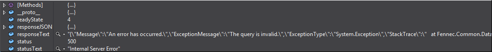
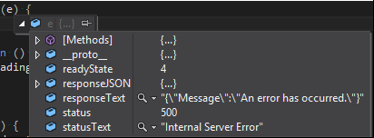

## Web.Config CustomErrors

[CustomErrors에 대한 docs](https://docs.microsoft.com/en-us/aspnet/web-forms/overview/older-versions-getting-started/deploying-web-site-projects/displaying-a-custom-error-page-cs)

CustomErrors  
  - On: 모든 사용자에게 커스텀 에러 페이지나 노란색 에러화면(YSOD)이 보인다. Exception Detail이 표시되지 않는다.
  - Off: 모든 사용자에게 YSOD가 보인다. Exception Detail이 표시된다.
  - RemoteOnly: Default 값. remote 사용자에게는 커스텀 에러 페이지나 YSOD가 보인다(On). local 사용자에게만 Exception Detail이 표시된다(Off).

--- 

디버깅해서 직접 확인 해보자.
- CustomErrors="Off" || (CustomErrors="RemoteOnly" && local 사용자)  
Client에서 Exception Detail이 표시된다.  

- CustomErrors="On" || (CustomErrors="RemoteOnly" && remote 사용자)  
Client에서 Exception Detail이 표시되지 않는다.  

같은 Exception으로 테스트했지만, 아래 responseText에서 exceptionMessage가 보이지 않는다.  
**만약 서버에서 클라이언트로 Custom Error Message를 전달해야 한다면 CustomErrors 설정에 따라 Client에서 확인 못할 수도 있다.**