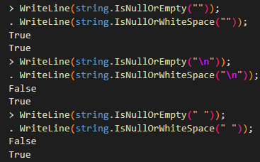

## string IsNullOrEmpty vs IsNullOrWhiteSpace

C#에서 빈 문자열 또는 null인 경우를 확인할 때 사용하는 Method의 차이를 알아보자.  
Visual Studio C# Interactive 기능을 이용해서 확인해봤다.

  

IsNullOrWhiteSpace()의 경우, space 또는 tab, line break도 true를 리턴한다.  
생각해보니 실제로 제품에서 사용할때 IsNullOrEmpty()로 충분할 것 같다. 

extension method로 `someStringVariable.IsNullOrEmpty()` 형식으로 사용하는 방법도 사용하기도 편하고 의미상으로도 좋을 것 같다.

### Reference
https://stackoverflow.com/questions/18710644/difference-between-isnullorempty-and-isnullorwhitespace-in-c-sharp