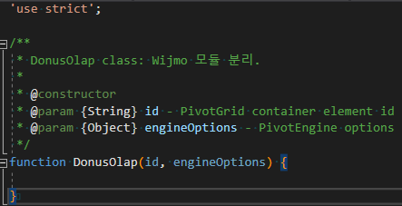
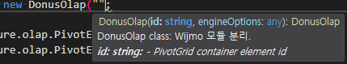

## JSDoc

C#의 `
` 처럼 javascript도 class나 function에 대한 설명을 표시할 수 있었다. 😮  

아래와 같이 es5 class 구조를 만들고 있다.  
parameter에 대한 설명을 해당 format에 맞춰서 표시한다면  

Visual Studio 2019에서 다음과 같이 preview를 볼 수 있다.  
커서에 아까 주석에 적었던 해당 class의 설명이 표시된다.  

이렇게 잘 설명을 적어놓으면 다른 사람이 기능을 사용할 때 큰 도움이 될 것 같다.  
팀에도 제안해야겠다.

### Reference
- https://jsdoc.app/about-getting-started.html
- https://devhints.io/jsdoc