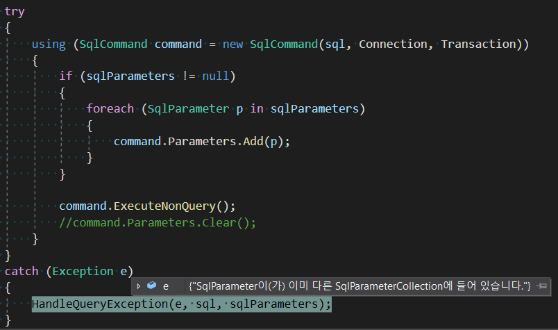

## SqlParameterCollection 에러

> The SqlParameter is already contained by another SqlParameterCollection
  
> SqlParameter이(가) 이미 다른 SqlParameterCollection에 들어 있습니다.



위와 같이 DB SQL 실행을 하는 method를 2번 호출하면 볼 수 있는 에러다.  
`using` 문이 끝나서 SqlCommand가 `Dispose()` 되어도 SqlParameter가 어떤 SqlCommand에서 사용되었는지 정보를 저장하고 있는 것 같다.  
`SqlCommand.Parameters.Clear()` method를 이용해서 해당 SqlCommand의 SQL parameter를 초기화해서 에러를 방지할 수 있다.  

```
command.Parameters.Clear();
```

아래 소스코드로 확인 가능하다.  
주석 제거 시 에러 발생하지 않음.
```
using (SqlCommand command = new SqlCommand(sql, Connection, Transaction))
{
    if (sqlParameters != null)
    {
        foreach (SqlParameter p in sqlParameters)
        {
            command.Parameters.Add(p);
        }
    }
    
    command.ExecuteNonQuery();
    //command.Parameters.Clear();
}
```
