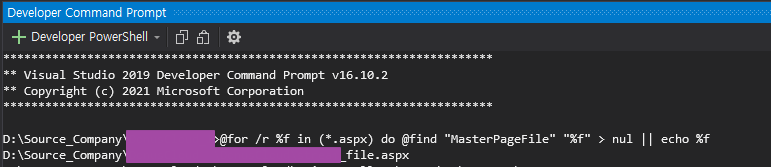
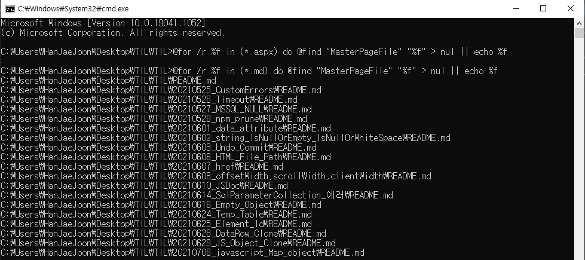

## [Visual Studio] 특정 문자열이 없는 파일 찾기(Developer Command Prompt)

개발을 하다보면 `ctrl` + `shift` + `f` 로 문자열을 찾는 것은 많이 할 수 밖에 없다.  
그렇다면 **특정 문자열이 없는 파일은 어떻게 찾아야 할까?**  
Visual Studio의 Developer Command Prompt를 이용하면 된다.  

아래는 Master File이 없는 aspx 파일을 찾을 때 사용한 예시다.  
전체 aspx 파일(`*.aspx`)에서 `MasterPageFile` 문자열이 없는 파일 목록을 출력한다.  

```
@for /r %f in (*.aspx) do @find "MasterPageFile" "%f" > nul || echo %f
```

실행하면 다음과 같이 파일 목록들이 출력된다.  


cmd에서 사용해도 된다.


### 참고
- [Developer Command Prompt 사용법](https://docs.microsoft.com/en-us/visualstudio/ide/reference/command-prompt-powershell?view=vs-2019)
- [Command List](https://www.thomas-krenn.com/en/wiki/Cmd_commands_under_Windows)