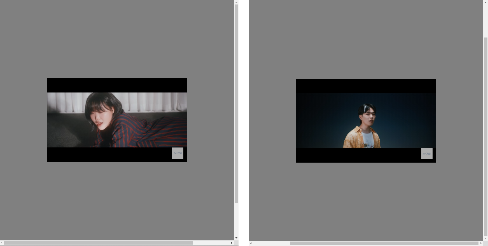

## [css] 모달을 항상 가운데로 정렬하기

outer div는 modal의 background layer다.  
jsfiddle에서 잘 보이도록 1000px로 고정시켜놨고 실제로는 100%를 사용한다.  
inner div에는 modal의 내용이 들어간다.  
요즘 잘 듣고있는 악뮤의 낙하 뮤직비디오를 넣었다.  

아래 fiddle에서 직접 확인할 수 있다.  
https://jsfiddle.net/jjhan/oem8sqa4/28/

### HTML
```
<div class="outer">
    <div class="inner">
      <iframe width="100%" height="100%" src="https://www.youtube.com/embed/EtiPbWzUY9o" title="YouTube video player" frameborder="0" allow="accelerometer; autoplay; clipboard-write; encrypted-media; gyroscope; picture-in-picture" allowfullscreen></iframe>
    </div>
</div>
```

### CSS
```
.outer {
  position: absolute;
  top: 0;
  left: 0;
  height: 1000px; /*100%*/
  width: 1000px; /*100%*/
  background-color: gray;
}

.inner {
  position: fixed;
  top: 0;
  bottom: 0;
  left: 0;
  right: 0;
  margin: auto;
  width: 500px;  
  height: 300px;
}
```

스크롤를 어떻게 움직이든 악뮤는 가운데 고정이 된다.  
 
