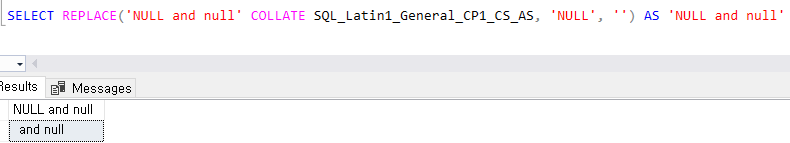

## [MS-SQL] 대소문자 구별해서 치환하기  

`REPLACE()` 사용 시 Case-sensitive 하게 Replace 하기 위해서 `COLLATE SQL_Latin1_General_CP1_CS_AS` 를 사용하면 된다.  

```
SELECT REPLACE('NULL and null' COLLATE SQL_Latin1_General_CP1_CS_AS, 'NULL', '');
```

`NULL` 과 `null` 중에 대문자 `NULL` 만 replace 된 것을 확인할 수 있다.  

