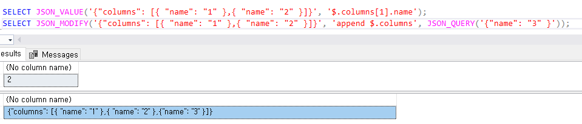

## [MS-SQL] JSON Parsing하기  

JSON parsing

SELECT JSON_VALUE('{"columns": [{ "name": "1" },{ "name": "2" }]}', '$.columns[1].name');
SELECT JSON_MODIFY('{"columns": [{ "name": "1" },{ "name": "2" }]}', 'append $.columns', JSON_QUERY('{"name": "3" }'));

